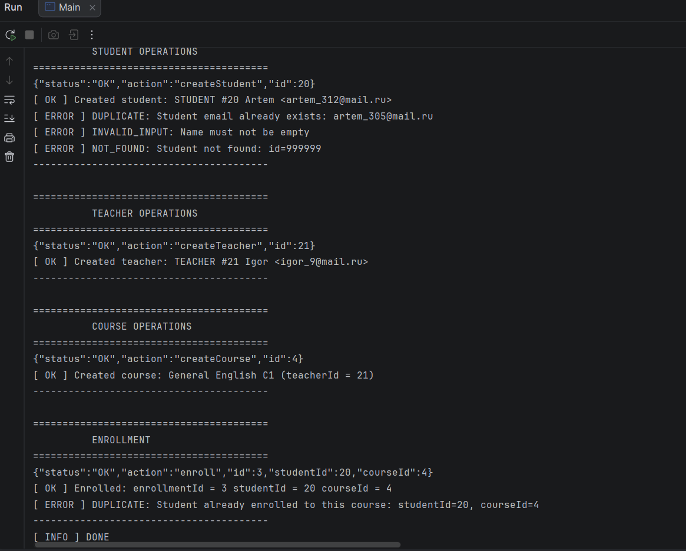

                        SQL
SELECT 
  e.id,
  p.name AS student,
  p.email,
  c.name AS course,
  c.level,
  e.enrolled_at
FROM enrollments e
JOIN students s ON s.person_id = e.student_id
JOIN persons p ON p.id = s.person_id
JOIN courses c ON c.id = e.course_id
ORDER BY e.id;

.png)

This project is a console-based REST-like API for a Language School Management System,
implemented in Java using JDBC and PostgreSQL

Architecture:
Controller → Service → Repository → DatabaseConnection → PostgreSQL

Entities and Relationships:

Student
Fields: email, level, discountPercent

Teacher
Fields: email, specialization, salaryPerMonth

Course
Fields: name, level, price, teacherId

Enrollment
Contains Student + Course, represents student enrollment to a course

In this project, I learned how to build a Java application using a multi-layer architecture
I practiced writing SQL queries
I learned how to create and handle custom exceptions for different error cases