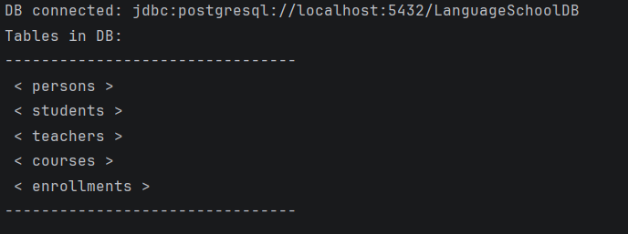
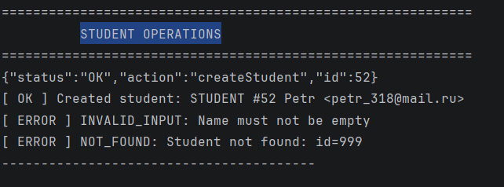
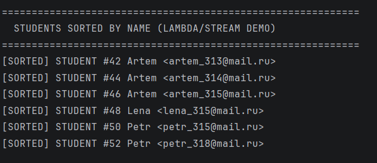
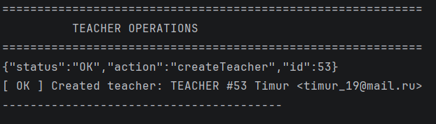
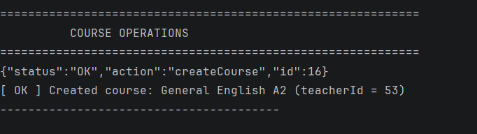
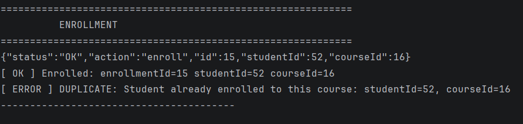

                        SQL
SELECT 
  e.id,
  p.name AS student,
  p.email,
  c.name AS course,
  c.level,
  e.enrolled_at
FROM enrollments e
JOIN students s ON s.person_id = e.student_id
JOIN persons p ON p.id = s.person_id
JOIN courses c ON c.id = e.course_id
ORDER BY e.id;

I created a console-based Java application for managing a language school.
The system works with students, teachers, courses, and enrollments,
and uses a PostgreSQL database with JDBC.

I improved my knowledge of Java OOP concepts such as
inheritance, abstract classes, interfaces.
I learned how to use JDBC to connect to a database.

The most interesting part of the project was using sorting
with lambda expressions and the Stream API.
It was interesting to see.

Database Connection

Student Operations

Students Sorted

Teacher Operations

Course Operations

Enrollment Operations

Reflection Demo – Student
.png)
Reflection Demo – Teacher
.png)

